## 下载

**注意：** Go语言1.14版本之后推荐使用go modules管理依赖，也不再需要把代码写在GOPATH目录下了。

### 下载地址

Go官网下载地址：https://golang.org/dl/

Go官方镜像站（推荐）：https://golang.google.cn/dl/

### 版本的选择 

Windows平台和Mac平台推荐下载可执行文件版，Linux平台下载压缩文件版。

下图中的版本号可能并不是最新的，但总体来说安装教程是类似的。Go语言更新迭代比较快，推荐使用较新版本，体验最新特性。

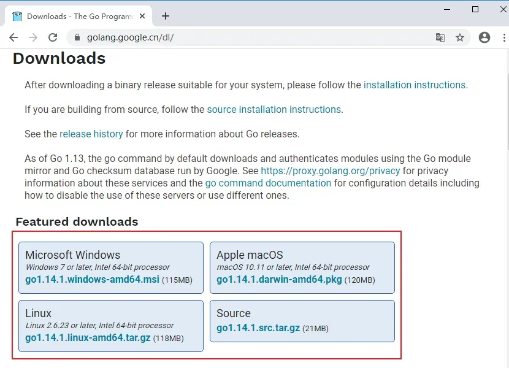

## 安装

### Windows安装

此安装实例以 64位Win10系统安装 Go1.14.1可执行文件版本为例。

将上一步选好的安装包下载到本地。

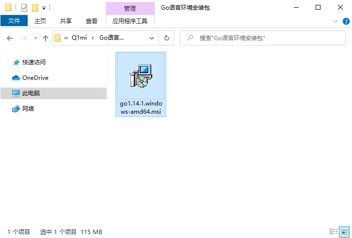

双击下载好的文件，然后按照下图的步骤安装即可。

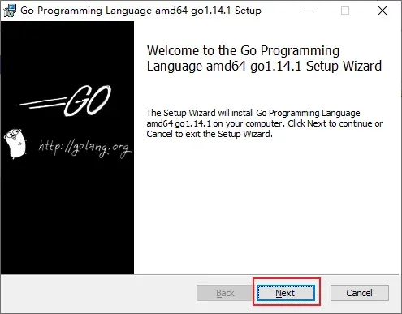

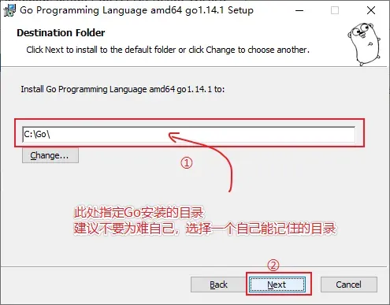

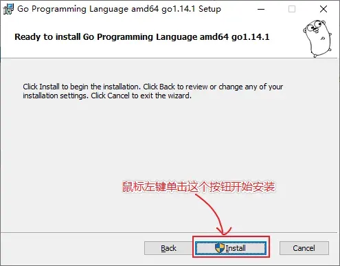

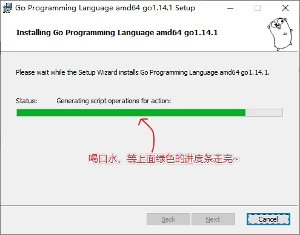

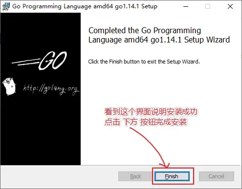

### Linux下安装

如果不是要在Linux平台敲go代码就不需要在Linux平台安装Go，我们开发机上写好的go代码只需要跨平台编译（详见文章末尾的跨平台编译）好之后就可以拷贝到Linux服务器上运行了，这也是go程序跨平台易部署的优势。

我们在版本选择页面选择并下载好go1.14.1.linux-amd64.tar.gz文件：

```cmd
wget https://dl.google.com/go/go1.14.1.linux-amd64.tar.gz
```
将下载好的文件解压到/usr/local目录下：
```cmd
tar -zxvf go1.14.1.linux-amd64.tar.gz -C /usr/local  # 解压
```

如果提示没有权限，加上sudo以root用户的身份再运行。执行完就可以在/usr/local/下看到go目录了。

配置环境变量： Linux下有两个文件可以配置环境变量，其中/etc/profile是对所有用户生效的；$HOME/.profile是对当前用户生效的，根据自己的情况自行选择一个文件打开，添加如下两行代码，保存退出。
```bash
export GOROOT=/usr/local/go
export PATH=$PATH:$GOROOT/bin
```
修改/etc/profile后要重启生效，修改$HOME/.profile后使用source命令加载$HOME/.profile文件即可生效。 检查：
```cmd
~ go version
go version go1.14.1 linux/amd64
```
### Mac下安装
下载可执行文件版，直接点击下一步安装即可，默认会将go安装到/usr/local/go目录下。

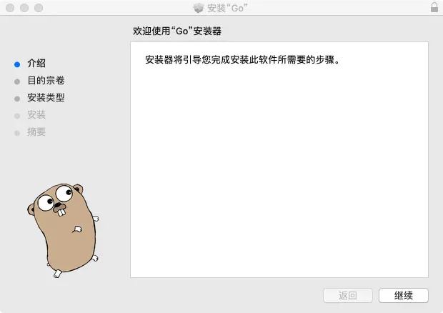

### 检查

上一步安装过程执行完毕后，可以打开终端窗口，输入go version命令，查看安装的Go版本。

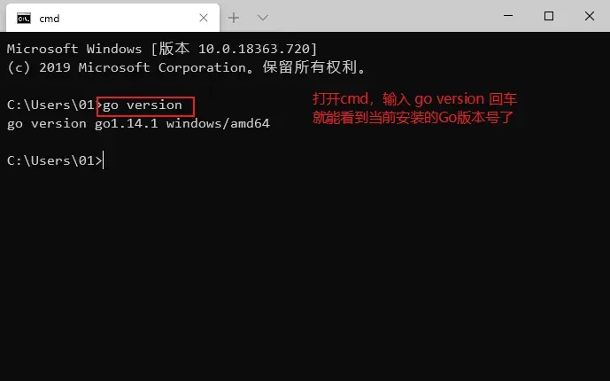

## GOROOT和GOPATH

GOROOT和GOPATH都是环境变量，其中GOROOT是我们安装go开发包的路径，而从Go 1.8版本开始，Go开发包在安装完成后会为GOPATH设置一个默认目录，并且在Go1.14及之后的版本中启用了Go Module模式之后，不一定非要将代码写到GOPATH目录下，所以也就不需要我们再自己配置GOPATH了，使用默认的即可。

想要查看你电脑上的GOPATH路径，只需要打开终端输入以下命令并回车：

```cmd
go env
```
在终端输出的内容中找到GOPATH对应的具体路径。

### GOPROXY 非常重要
Go1.14版本之后，都推荐使用go mod模式来管理依赖环境了，也不再强制我们把代码必须写在GOPATH下面的src目录了，你可以在你电脑的任意位置编写go代码。（网上有些教程适用于1.11版本之前。）

默认GoPROXY配置是：GOPROXY=https://proxy.golang.org,direct，由于国内访问不到https://proxy.golang.org，所以我们需要换一个PROXY，这里推荐使用https://goproxy.io或https://goproxy.cn。

可以执行下面的命令修改GOPROXY：
```cmd
go env -w GOPROXY=https://goproxy.cn,direct
```

## Go开发编辑器

Go采用的是UTF-8编码的文本文件存放源代码，理论上使用任何一款文本编辑器都可以做Go语言开发，这里推荐使用VS Code和Goland。 VS Code是微软开源的编辑器，而Goland是jetbrains出品的付费IDE。

我们这里使用VS Code 加插件做为go语言的开发工具。
### VS Code介绍
VS Code全称Visual Studio Code，是微软公司开源的一款免费现代化轻量级代码编辑器，支持几乎所有主流的开发语言的语法高亮、智能代码补全、自定义热键、括号匹配、代码片段、代码对比 Diff、GIT 等特性，支持插件扩展，支持 Win、Mac 以及 Linux平台。

虽然不如某些IDE功能强大，但是它添加Go扩展插件后已经足够胜任我们日常的Go开发。

### 下载与安装
VS Code官方下载地址：https://code.visualstudio.com/Download

三大主流平台都支持，请根据自己的电脑平台选择对应的安装包。

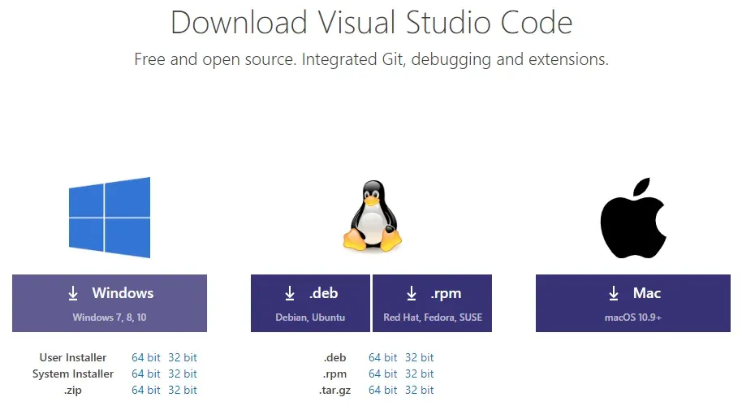

双击下载好的安装文件，双击安装即可。
### 配置
#### 安装中文简体插件
点击左侧菜单栏最后一项管理扩展，在搜索框中输入chinese ，选中结果列表第一项，点击install安装。

安装完毕后右下角会提示重启VS Code，重启之后你的VS Code就显示中文啦！

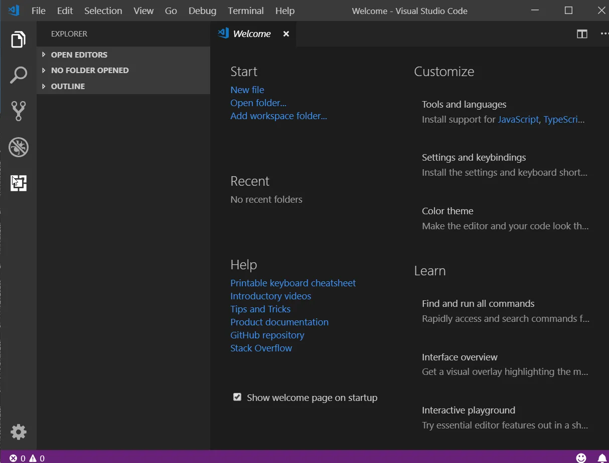

VSCode主界面介绍：

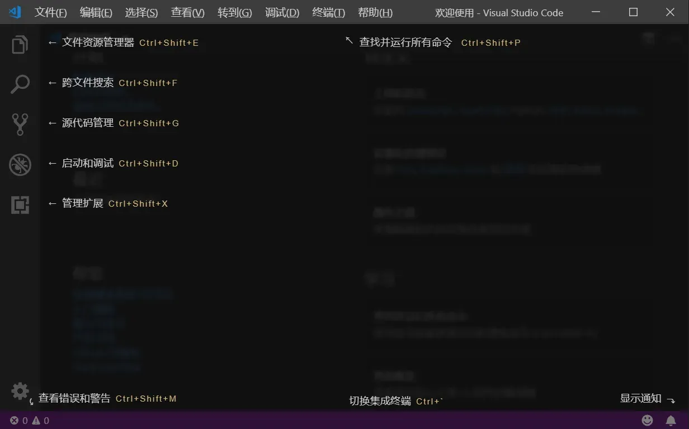
#### 安装go扩展
现在我们要为我们的VS Code编辑器安装Go扩展插件，让它支持Go语言开发。
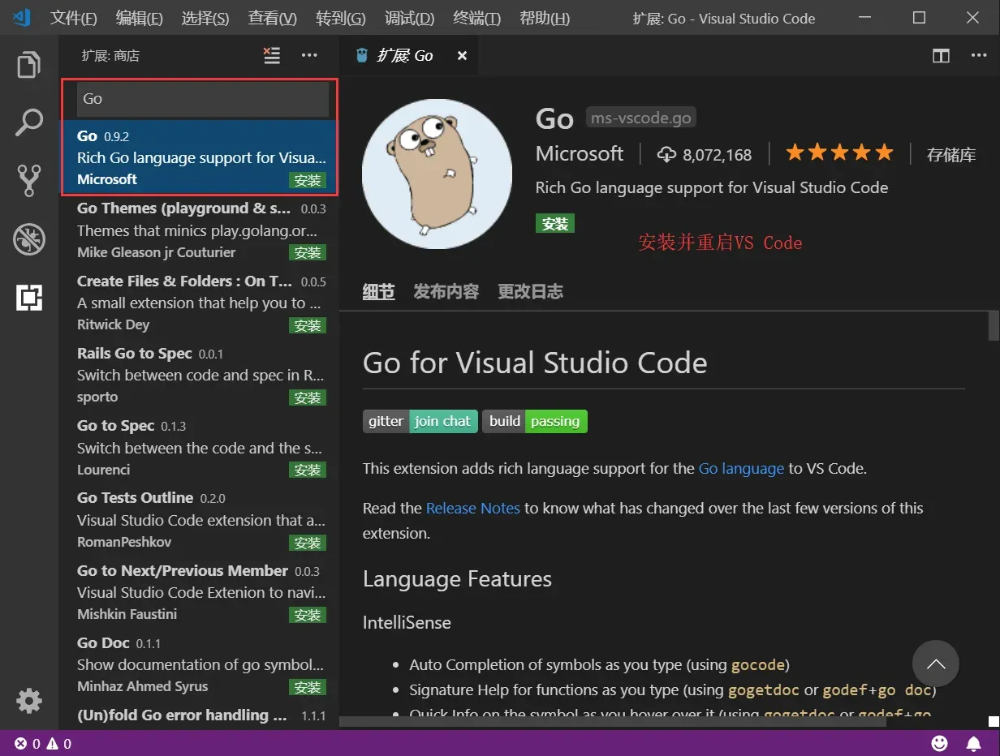

## 第一个Go程序
### Hello World
现在我们来创建第一个Go项目——hello。在我们桌面创建一个hello目录。
#### go mod init 
使用go module模式新建项目时，我们需要通过go mod init 项目名命令对项目进行初始化，该命令会在项目根目录下生成go.mod文件。例如，我们使用hello作为我们第一个Go项目的名称，执行如下命令。
```cmd
go mod init hello
```
#### 编写代码
接下来在该目录中创建一个main.go文件：
```go
package main  // 声明 main 包，表明当前是一个可执行程序

import "fmt"  // 导入内置 fmt 包

func main(){  // main函数，是程序执行的入口
	fmt.Println("Hello World!")  // 在终端打印 Hello World!
}
```
非常重要！！！ 如果此时VS Code右下角弹出提示让你安装插件，务必点 install all 进行安装。

这一步需要先执行完上面提到的go env -w GOPROXY=https://goproxy.cn,direct命令配置好GOPROXY。
### 编译
go build命令表示将源代码编译成可执行文件。

在hello目录下执行：
```cmd
go build
```
编译得到的可执行文件会保存在执行编译命令的当前目录下，如果是Windows平台会在当前目录下找到hello.exe可执行文件。

可在终端直接执行该hello.exe文件：
```cmd
c:\desktop\hello>hello.exe
Hello World!
```
我们还可以使用-o参数来指定编译后得到的可执行文件的名字。
```cmd
go build -o heiheihei.exe
```
### Windows下VSCode切换cmd.exe作为默认终端
如果你打开VS Code的终端界面出现如下图场景（注意观察红框圈中部分），那么你的VS Code此时正使用powershell作为默认终端：

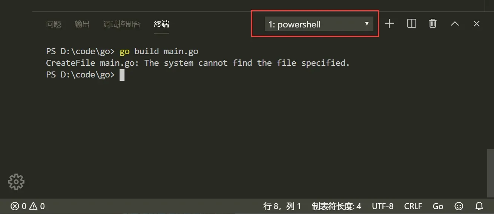

十分推荐你按照下面的步骤，选择cmd.exe作为默认的终端工具：

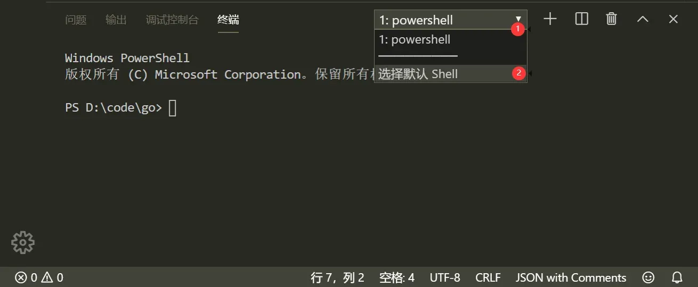

此时，VS Code正上方中间位置会弹出如下界面，参照下图挪动鼠标使光标选中后缀为cmd.exe的那一个，然后点击鼠标左键。

最后重启VS Code中已经打开的终端或者直接重启VS Code就可以了。

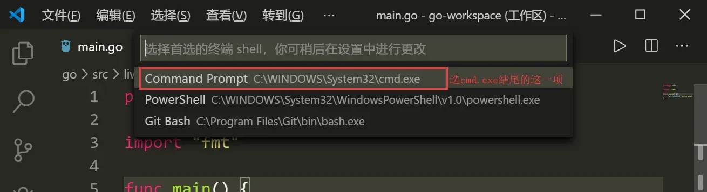

如果没有出现下拉三角，也没有关系，按下Ctrl+Shift+P，VS Code正上方会出现一个框，你按照下图输入shell，然后点击指定选项即可出现上面的界面了。

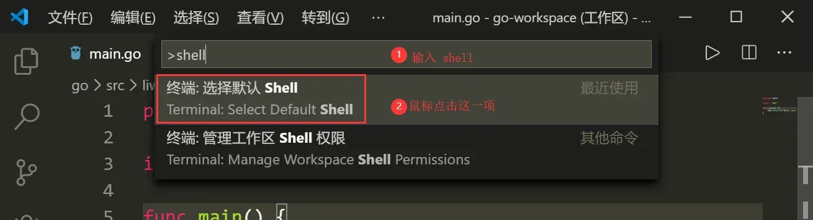

### go run

go run main.go也可以执行程序，该命令本质上是先在临时目录编译程序然后再执行。
> 如果你不清楚上方关于go run执行机制的描述，那么你最好今后都使用go build编译再执行。

### go install

go install表示安装的意思，它先编译源代码得到可执行文件，然后将可执行文件移动到GOPATH的bin目录下。因为我们把GOPATH下的bin目录添加到了环境变量中，所以我们就可以在任意地方直接执行可执行文件了。

### 跨平台编译
默认我们go build的可执行文件都是当前操作系统可执行的文件，Go语言支持跨平台编译——在当前平台（例如Windows）下编译其他平台（例如Linux）的可执行文件。
#### Windows编译Linux可执行文件 
如果我想在Windows下编译一个Linux下可执行文件，那需要怎么做呢？只需要在编译时指定目标操作系统的平台和处理器架构即可。
> 注意：无论你在Windows电脑上使用VsCode编辑器还是Goland编辑器，都要注意你使用的终端类型，因为不同的终端下命令不一样！！！目前的Windows通常默认使用的是PowerShell终端。

如果你的Windows使用的是cmd，那么按如下方式指定环境变量。
```cmd
SET CGO_ENABLED=0  // 禁用CGO
SET GOOS=linux  // 目标平台是linux
SET GOARCH=amd64  // 目标处理器架构是amd64
```
如果你的Windows使用的是PowerShell终端，那么设置环境变量的语法为：
```powershell
$ENV:CGO_ENABLED=0
$ENV:GOOS="linux"
$ENV:GOARCH="amd64"
```
在你的Windows终端下执行完上述命令后，再执行下面的命令，得到的就是能够在Linux平台运行的可执行文件了。
```cmd
go build
```
#### Windows编译Mac可执行文件
Windows下编译Mac平台64位可执行程序：

cmd终端下执行：
```cmd
SET CGO_ENABLED=0
SET GOOS=darwin
SET GOARCH=amd64
go build
```
PowerShell终端下执行：
```cmd
$ENV:CGO_ENABLED=0
$ENV:GOOS="darwin"
$ENV:GOARCH="amd64"
go build
```
#### Mac编译Linux可执行文件
Mac电脑编译得到Linux平台64位可执行程序：
```
CGO_ENABLED=0 GOOS=linux GOARCH=amd64 go build
```
#### Mac编译Windows可执行文件
Mac电脑编译得到Windows平台64位可执行程序：
```
CGO_ENABLED=0 GOOS=windows GOARCH=amd64 go build
```
#### Linux编译Mac可执行文件
Linux平台下编译Mac平台64位可执行程序：
```
CGO_ENABLED=0 GOOS=darwin GOARCH=amd64 go build
```
#### Linux编译Windows可执行文件 
Linux平台下编译Windows平台64位可执行程序：
```
CGO_ENABLED=0 GOOS=windows GOARCH=amd64 go build
```
现在，开启你的Go语言学习之旅吧。人生苦短，let’s Go.