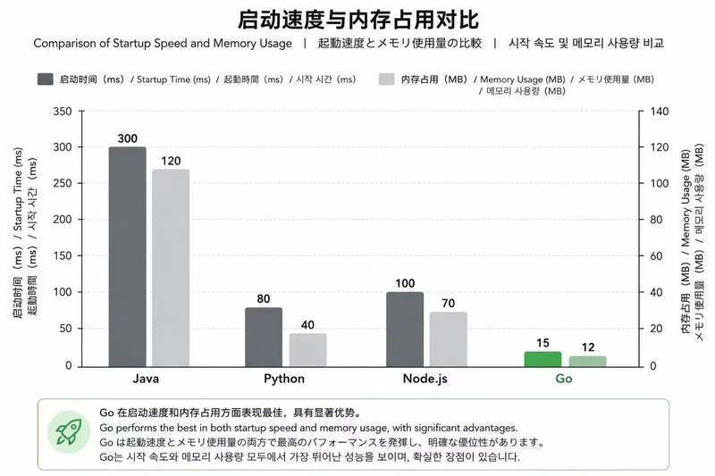

## 前言

假设你要做一道复杂的菜：又要蒸鱼、又要炖汤、又要炒青菜。传统厨房只有一个灶台，你得排队做；而 Go 语言给你一个"拥有多个灶台的智能厨房"，每个灶台互不干扰——这就是并发的力量。今天我们就来聊聊，为什么 Go 是面向未来的语言。

## Go 语言的身世

Go 语言诞生于 2007 年 Google 内部，由 Robert Griesemer、Rob Pike、Ken Thompson 三位大神设计。

为什么他们要造新语言？因为 Google 那时候的 C++ 编译太慢（编译一次要几十分钟），Java 又太啰嗦且并发复杂，Python 虽快但运行效率低。他们想要：

- 编译快（像写脚本一样）
- 运行快（接近 C）
- 并发写起来简单（像写同步代码）
- 语言简洁，团队协作不吵架

于是 2009 年 Go 正式开源，2012 年推出 1.0 版本。到现在，Docker、Kubernetes、etcd、Prometheus 这些云原生基石都是用 Go 写的。



## Go 的核心特点

### 表格示例

| 特点 | 生活类比 | 对开发者的好处 |
|------|------|------|
| 并发 goroutine | 餐厅后厨有 10 个灶台，每个灶台同时炒一道菜。一个灶台等水开时，其他灶台照样炒菜 | 写高并发服务器不再需要纠结线程池、锁、回调地狱 |
| 语法极简 | 白墙灰瓦，没有雕梁画栋。25 个关键字，你两天就能背完 | 代码风格统一，看别人的代码像自己写的；新手一周就能上手 |
| 编译超级快 | 点一下"运行"按钮，几乎没延迟就能跑起来 | 开发体验好，不用等编译；大项目也能秒级完成 |
| 标准库强大 | 买房送精装修：网络、加密、压缩、HTTP 服务、JSON 解析全内置 | 不用到处找第三方库，减少依赖和 bug |
| 静态类型 + GC | 编译时就把"盘子材质检查好"，但自动帮你洗碗 | 既安全（类型错误编不过），又省心（不用手动释放内存） |

## 主要应用场景

1. **云原生基础设施**
   - Docker：用 Go 写的跨平台容器引擎。
   - Kubernetes：容器编排的事实标准。
   - 为什么选 Go？跨平台（Linux/Windows）、并发处理高 I/O、性能好。

2. **微服务 / API 网关**
   - Traefik、Consul、Etcd 都用 Go 写。
   - 优点：单个二进制文件部署（无依赖）、内存占用低（几十 MB）、启动快（毫秒级）。

3. **高性能 CLI 工具**
   - kubectl（k8s 客户端）、docker CLI、GitHub CLI 都是 Go 写的。
   - 理由：编译后只有一个文件，分发方便；启动快，适合命令行交互。

4. **Web 后端（API 服务）**
   - 国内很多公司用 Go 做高并发业务接口（如今日头条部分服务）。
   - 对比 Java：启动快、资源省；对比 Python：性能高数倍。

5. **分布式存储 & 中间件**
   - TiDB（开源分布式数据库）、InfluxDB（时序数据库）、NSQ（消息队列）。
   - 优势：并发模型简单，网络库高效，GC 延迟低。

6. **DevOps & 工具链**
   - Terraform、Prometheus、Drone CI 都是 Go 编写。
   - 易交叉编译（一个命令生成 Linux/Windows/Mac 二进制），适合运维工具。

## 可运行代码示例（感受 Go 的魅力）

```go
package main

import (
    "fmt"
    "net/http"
)

func main() {
    // 定义一个处理函数
    http.HandleFunc("/", func(w http.ResponseWriter, r *http.Request) {
        fmt.Fprintf(w, "欢迎来到 Go 的世界！")
    })

    // 启动 Web 服务器，监听 8080 端口
    http.ListenAndServe(":8080", nil)
}
```

如何运行？

1. 保存为 `main.go`
2. 终端执行 `go run main.go`
3. 浏览器打开 `http://localhost:8080`

你会发现，只用了 5 行核心代码，就启动了一个 HTTP 服务器。如果用 Java 传统写法要多少行？至少几十行带一堆配置。

## 常见误解

| 误解 | 生活类比 |
|------|------|
| "Go 不能写图形界面程序" | 可以用 andlabs/ui、fyne 等库写桌面应用，虽然不是主流 |
| "Go 没有泛型，不好用" | Go 1.18 已正式加入泛型，常用场景如 slices、maps 包都已支持 |
| "Go 的 error 处理太啰嗦" | 确实需要写很多 `if err != nil`，但换来显式错误传递，不会出现未捕获的异常 |
| "Go 的包管理不行" | 从 1.11 起 go mod 已是官方标准，支持版本语义、私有仓库、代理 |

## 文末总结

Go 是一门"反内卷"的语言：它没有没完没了的语法糖，没有复杂的继承和多态，但用它写并发程序就像呼吸一样自然。

正因如此，它成为了云原生时代的"通用语"。下一篇我们将从零开始搭建 Go 开发环境，让你写出并运行第一个 Go 程序。
